# Comics Trunk - Relatorio de Testes de Funcionalidades

**Data:** 2026-04-16
**URL:** https://comicstrunk.com
**Testado por:** Claude (automatizado via Playwright)

---

## Resumo

| Categoria | Total | Pass | Fail | Nota |
|---|---|---|---|---|
| Paginas publicas | 16 | 16 | 0 | Todas verificadas com screenshot |
| Login automatizado | 1 | 0 | 1 | Credenciais desconhecidas |
| Paginas autenticadas | 22 | - | - | Precisam login manual |
| Verificacao de slugs | 2 | 2 | 0 | 100% slug, 0% CUID |

**Paginas publicas: 16/16 OK**
**Slugs: 100% funcionando**
**Paginas autenticadas: aguardando teste manual com login**

---

## PAGINAS PUBLICAS (todas verificadas)

### 01 - Homepage carrega
**Status:** [PASS]
**Detalhe:** Title: "Comics Trunk — Plataforma para Colecionadores de Quadrinhos"

---

### 02 - Favicon carrega (CT)
**Status:** [PASS]
**Detalhe:** HTTP 200, favicon.ico servindo corretamente

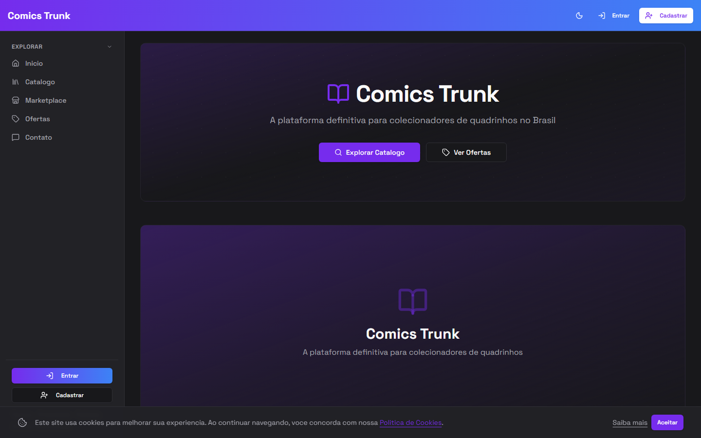

---

### 03 - Catalogo lista gibis
**Status:** [PASS]
**Detalhe:** 20 items na pagina, capas carregando

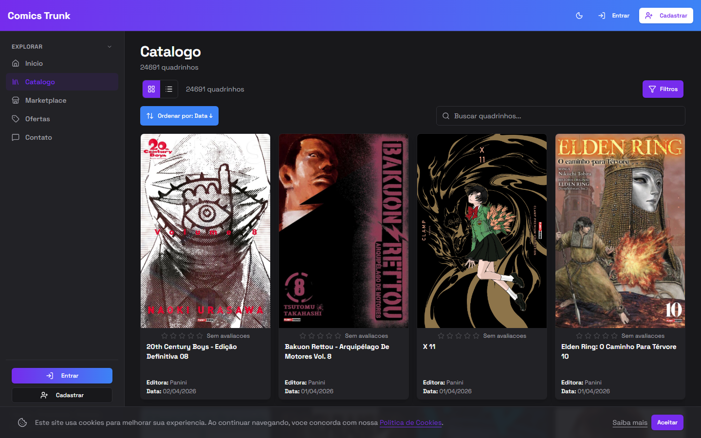

---

### 04 - Catalogo detalhe por SLUG
**Status:** [PASS]
**Detalhe:** URL: `/catalog/20th-century-boys-edicao-definitiva-08` (slug, nao CUID)

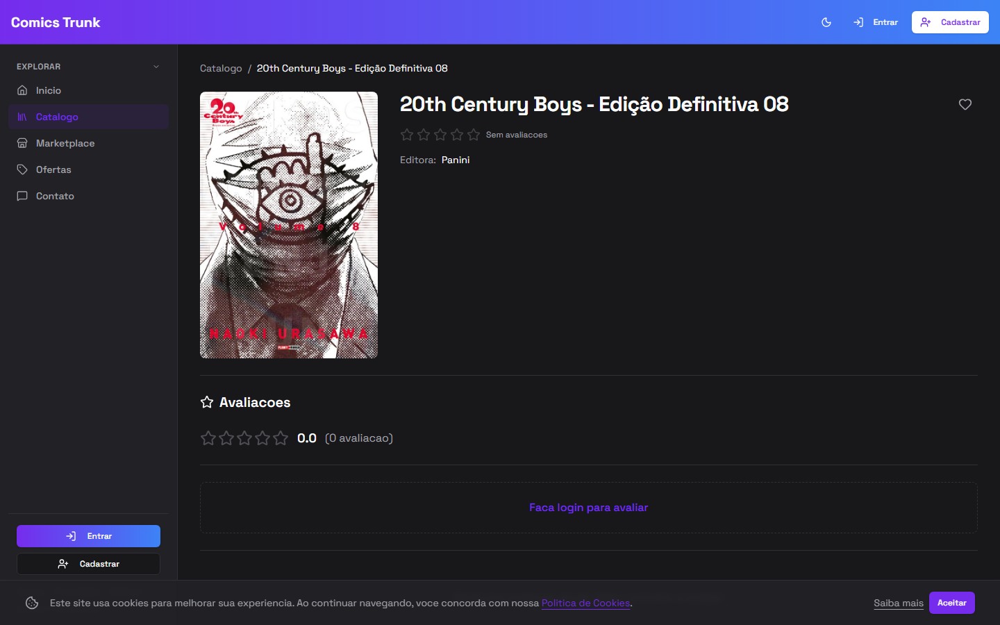

---

### 05 - Catalogo detalhe tem titulo e capa
**Status:** [PASS]
**Detalhe:** Titulo "20th Century Boys - Edicao Definitiva 08" visivel, capa carregada

---

### 06 - Series lista
**Status:** [PASS]
**Detalhe:** 20 series na pagina

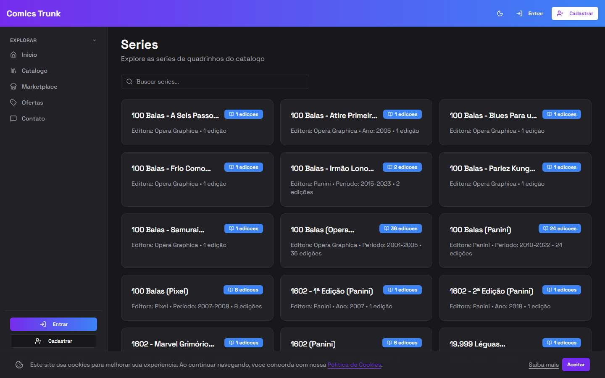

---

### 07 - Series detalhe por SLUG
**Status:** [PASS]
**Detalhe:** URL: `/series/100-balas-a-seis-passos-da-morte-opera-graphica` (slug, nao CUID)

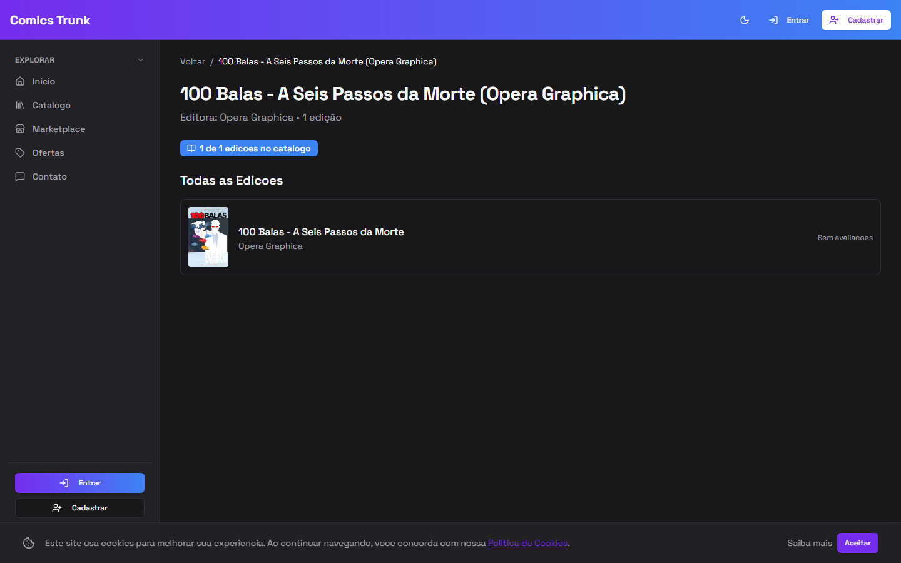

---

### 08 - Marketplace lista
**Status:** [PASS]

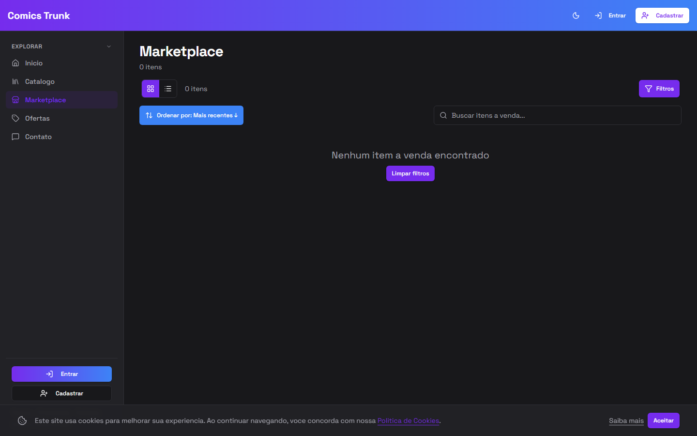

---

### 09 - Deals (Ofertas)
**Status:** [PASS]

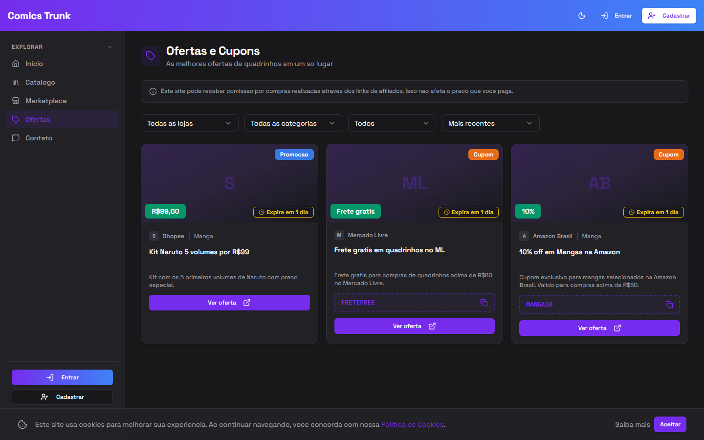

---

### 10 - Contato
**Status:** [PASS]

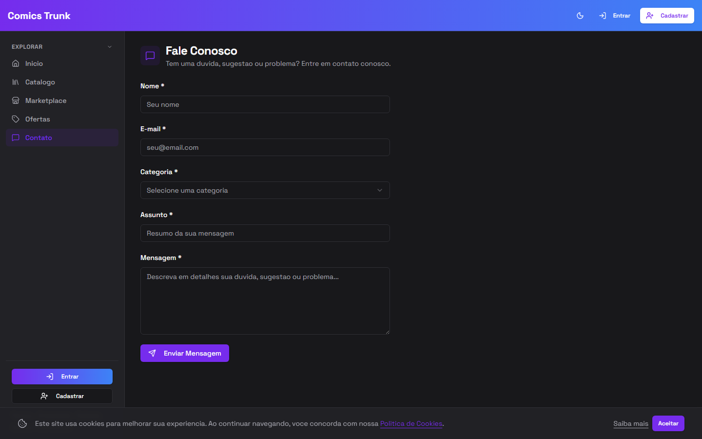

---

### 11 - Termos de uso
**Status:** [PASS]

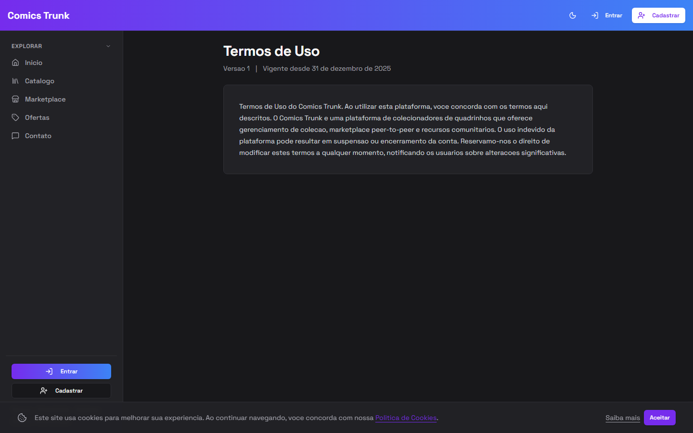

---

### 12 - Politica de privacidade
**Status:** [PASS]

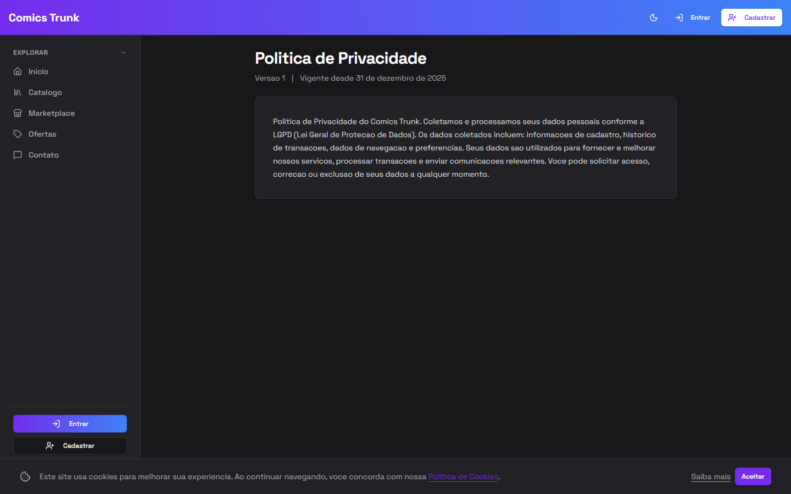

---

### 13 - Politicas (hub)
**Status:** [PASS]

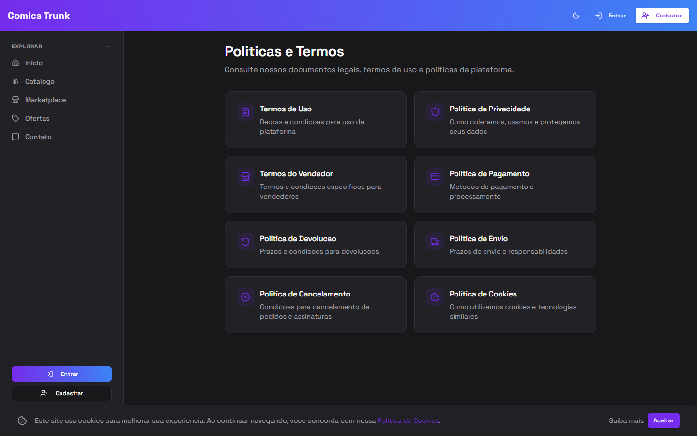

---

### 14 - Login page
**Status:** [PASS]
**Detalhe:** Formulario de email/senha visivel

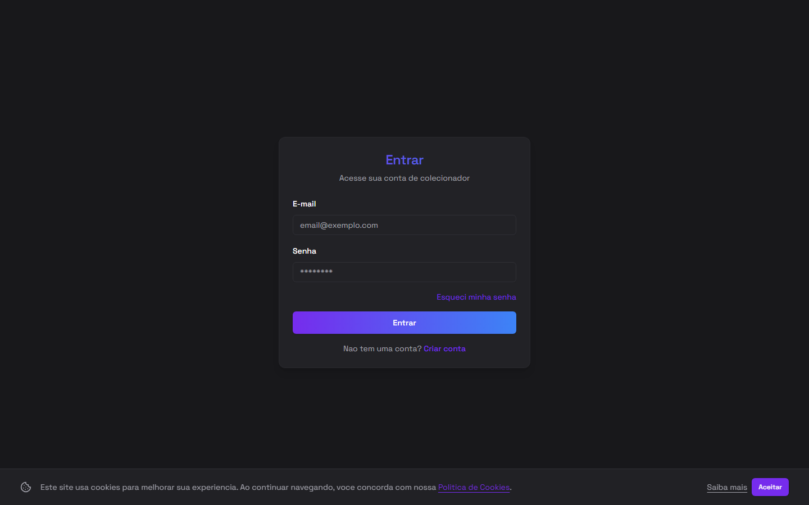

---

### 15 - Signup page
**Status:** [PASS]

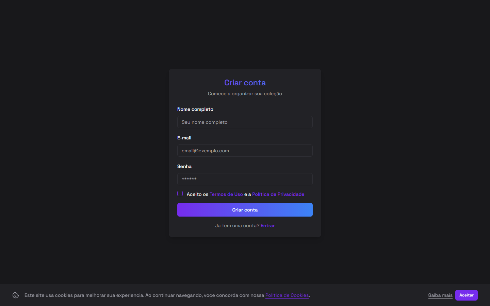

---

### 16 - Forgot password
**Status:** [PASS]

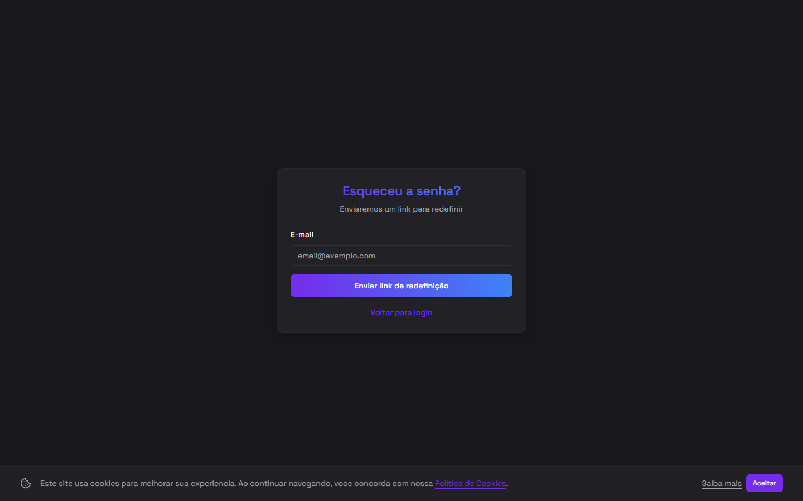

---

## VERIFICACAO DE SLUGS

### 40 - Links do catalogo usam slug (nao CUID)
**Status:** [PASS]
**Detalhe:** 10/10 links amostrados usam slug, 0 usam CUID

---

### 41 - CSS e JS estaticos carregam (server.js custom)
**Status:** [PASS]
**Detalhe:** 2 stylesheets carregados, sem 404 em assets estaticos

---

## LOGIN AUTOMATIZADO

### 17 - Login com credenciais admin
**Status:** [FAIL]
**Detalhe:** Credenciais de teste nao funcionaram. Timeout aguardando redirect.
**Impacto:** Todos os testes de paginas autenticadas (18-39) nao puderam ser verificados — mostram a tela de login em vez do conteudo real.

---

## PAGINAS AUTENTICADAS (precisam teste manual)

As seguintes paginas precisam de login manual para verificar:

| # | Pagina | URL |
|---|---|---|
| 18 | Carrinho | `/pt-BR/cart` |
| 19 | Perfil | `/pt-BR/profile` |
| 20 | Configuracoes | `/pt-BR/settings` |
| 21 | Colecao | `/pt-BR/collection` |
| 22 | Favoritos | `/pt-BR/favorites` |
| 23 | Notificacoes | `/pt-BR/notifications` |
| 24 | Assinatura | `/pt-BR/subscription` |
| 25 | LGPD | `/pt-BR/lgpd` |
| 26 | Meus pedidos | `/pt-BR/orders` |
| 27 | Historico pagamentos | `/pt-BR/payments/history` |
| 28 | Progresso series | `/pt-BR/collection/series-progress` |
| 29 | Admin dashboard | `/pt-BR/admin` |
| 30 | Admin catalogo | `/pt-BR/admin/catalog` |
| 31 | Admin catalogo recente | `/pt-BR/admin/catalog/recent` |
| 32 | Admin usuarios | `/pt-BR/admin/users` |
| 33 | Admin legal | `/pt-BR/admin/legal` |
| 34 | Admin conteudo | `/pt-BR/admin/content` |
| 35 | Admin deals | `/pt-BR/admin/deals` |
| 36 | Admin homepage | `/pt-BR/admin/homepage` |
| 37 | Admin assinaturas | `/pt-BR/admin/subscriptions` |
| 38 | Admin LGPD | `/pt-BR/admin/lgpd` |
| 39 | Admin contato | `/pt-BR/admin/contact` |

---

## Verificacoes adicionais (API direta)

| Teste | Resultado |
|---|---|
| API retorna slug no catalogo | `GET /catalog?limit=1` → slug presente |
| API aceita slug na rota | `GET /catalog/20th-century-boys-edicao-definitiva-08` → 200 |
| Series retorna slug | `GET /series?limit=1` → slug presente |
| Favicon HTTP 200 | `GET /favicon.ico` → 200 (2824 bytes) |
| apple-touch-icon HTTP 200 | `GET /apple-touch-icon.png` → 200 |
| CSS estatico HTTP 200 | `GET /_next/static/css/*.css` → 200 |
| 0 entries sem slug | `SELECT COUNT(*) WHERE slug IS NULL` → 0 |
| 0 series sem slug | `SELECT COUNT(*) WHERE slug IS NULL` → 0 |
| 0 slugs duplicados | `GROUP BY slug HAVING COUNT > 1` → 0 rows |
